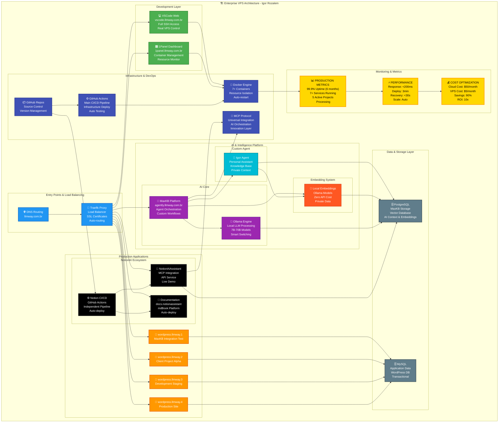

```mermaid
graph TB
    subgraph "🏗️ Enterprise VPS Architecture - Igor Rozalem"
        subgraph "Entry Points & Load Balancing"
            DNS["🌐 DNS Routing<br/>llmway.com.br"]
            Traefik["🔀 Traefik Proxy<br/>Load Balancer<br/>SSL Certificates<br/>Auto-routing"]
        end
        
        subgraph "Development Layer"
            VSCode["💻 VSCode Web<br/>vscode.llmway.com.br<br/>Full SSH Access<br/>Real VPS Control"]
            Panel["🎛️ 1Panel Dashboard<br/>1panel.llmway.com.br<br/>Container Management<br/>Resource Monitor"]
        end
        
        subgraph "AI & Intelligence Platform"
            subgraph "Embedding System"
                LocalEmbed["🧠 Local Embeddings<br/>Ollama Models<br/>Zero API Cost<br/>Private Data"]
            end
            
            subgraph "Custom Agent"
                IgorAgent["🤖 Igor Agent<br/>Personal Assistant<br/>Knowledge Base<br/>Private Context"]
            end
            
            subgraph "AI Core"
                MaxKB["🎯 MaxKB Platform<br/>agently.llmway.com.br<br/>Agent Orchestration<br/>Custom Workflows"]
                Ollama["🦙 Ollama Engine<br/>Local LLM Processing<br/>7B-70B Models<br/>Smart Switching"]
            end
        end
        
        subgraph "Production Applications"
            WP1["📱 wordpress.llmway.1<br/>MaxKB Integration Test"]
            WP2["📱 wordpress.llmway.2<br/>Client Project Alpha"]
            WP3["📱 wordpress.llmway.3<br/>Development Staging"]
            WP4["📱 wordpress.llmway.4<br/>Production Site"]
            
            subgraph "NotionAI Ecosystem"
                NotionAPI["📝 NotionAiAssistant<br/>MCP Integration<br/>API Service<br/>Live Demo"]
                NotionCICD["⚙️ Notion CI/CD<br/>GitHub Actions<br/>Independent Pipeline<br/>Auto-deploy"]
                Docs["📖 Documentation<br/>docs.notionassistant<br/>mdBook Platform<br/>Auto-deploy"]
            end
        end
        
        subgraph "Data & Storage Layer"
            MySQL["🗄️ MySQL<br/>Application Data<br/>WordPress DB<br/>Transactional"]
            Postgres["🗄️ PostgreSQL<br/>MaxKB Storage<br/>Vector Database<br/>AI Context & Embeddings"]
        end
        
        subgraph "Infrastructure & DevOps"
            Docker["🐳 Docker Engine<br/>7+ Containers<br/>Resource Isolation<br/>Auto-restart"]
            GitHub["📦 GitHub Repos<br/>Source Control<br/>Version Management"]
            Actions["⚙️ GitHub Actions<br/>Main CI/CD Pipeline<br/>Infrastructure Deploy<br/>Auto Testing"]
            MCP["🔗 MCP Protocol<br/>Universal Integration<br/>AI Orchestration<br/>Innovation Layer"]
        end
        
        subgraph "Monitoring & Metrics"
            Metrics["📊 PRODUCTION METRICS<br/>99.9% Uptime (6 months)<br/>7+ Services Running<br/>5 Active Projects<br/> Processing"]
            Performance["⚡ PERFORMANCE<br/>Response: <200ms<br/>Deploy: 3min<br/>Recovery: <30s<br/>Scale: Auto"]
            Savings["💰 COST OPTIMIZATION<br/>Cloud Cost: $50/month<br/>VPS Cost: $5/month<br/>Savings: 90%<br/>ROI: 10x"]
        end
    end
    
    DNS --> Traefik
    Traefik --> VSCode
    Traefik --> Panel
    Traefik --> MaxKB
    Traefik --> WP1
    Traefik --> WP2
    Traefik --> WP3
    Traefik --> WP4
    Traefik --> NotionAPI
    Traefik --> Docs
    
    VSCode --> Docker
    Panel --> Docker
    
    MaxKB --> LocalEmbed
    MaxKB --> IgorAgent
    MaxKB --> Ollama
    
    IgorAgent --> LocalEmbed
    IgorAgent --> Postgres
    LocalEmbed --> Postgres
    
    Ollama --> Postgres
    
    WP1 --> MySQL
    WP2 --> MySQL
    WP3 --> MySQL
    WP4 --> MySQL
    
    NotionAPI --> Postgres
    NotionAPI --> MCP
    NotionCICD --> NotionAPI
    NotionCICD --> Docs
    MaxKB --> MCP
    
    GitHub --> Actions
    GitHub --> NotionCICD
    Actions --> Docker
    
    Docker --> Metrics
    Metrics --> Performance
    Performance --> Savings
    
    classDef entryClass fill:#2196F3,stroke:#1565C0,stroke-width:2px,color:#fff
    classDef devClass fill:#4CAF50,stroke:#2E7D32,stroke-width:2px,color:#fff
    classDef aiClass fill:#9C27B0,stroke:#6A1B9A,stroke-width:2px,color:#fff
    classDef embedClass fill:#FF5722,stroke:#D84315,stroke-width:2px,color:#fff
    classDef agentClass fill:#00BCD4,stroke:#00838F,stroke-width:2px,color:#fff
    classDef prodClass fill:#FF9800,stroke:#E65100,stroke-width:2px,color:#fff
    classDef notionClass fill:#000000,stroke:#333333,stroke-width:2px,color:#fff
    classDef dataClass fill:#607D8B,stroke:#37474F,stroke-width:2px,color:#fff
    classDef infraClass fill:#3F51B5,stroke:#283593,stroke-width:2px,color:#fff
    classDef metricsClass fill:#FFD700,stroke:#FFA000,stroke-width:3px,color:#000
    
    class DNS,Traefik entryClass
    class VSCode,Panel devClass
    class MaxKB,Ollama aiClass
    class LocalEmbed embedClass
    class IgorAgent agentClass
    class WP1,WP2,WP3,WP4 prodClass
    class NotionAPI,NotionCICD,Docs notionClass
    class MySQL,Postgres dataClass
    class Docker,GitHub,Actions,MCP infraClass
    class Metrics,Performance,Savings metricsClass
```
