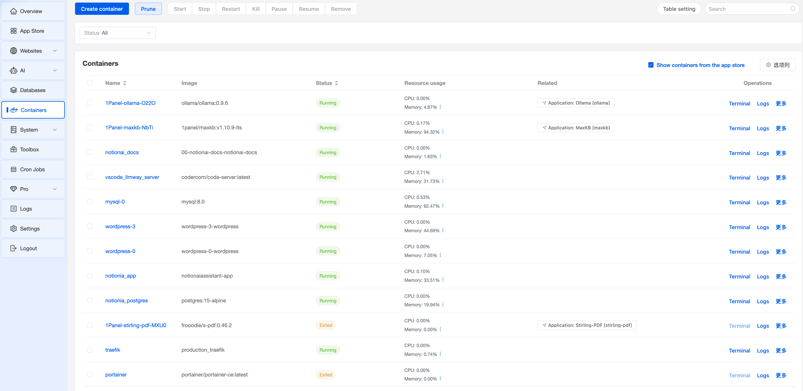
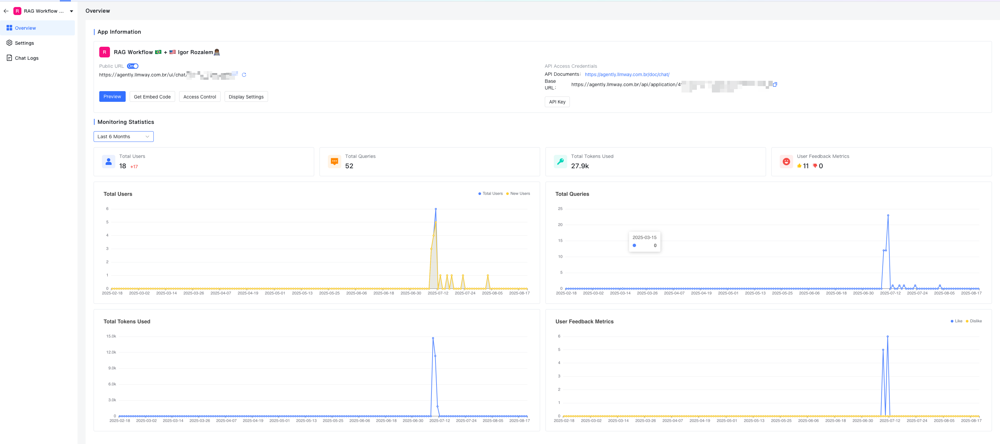
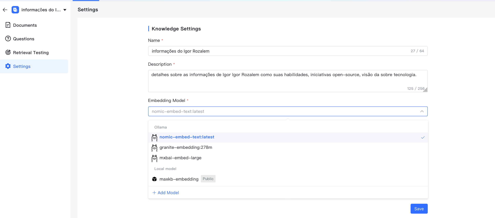
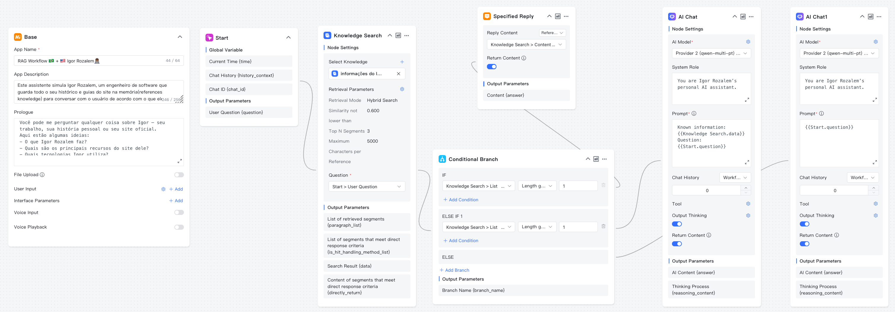
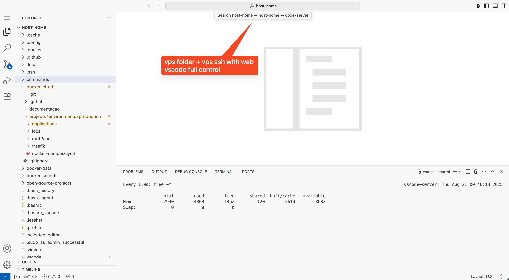
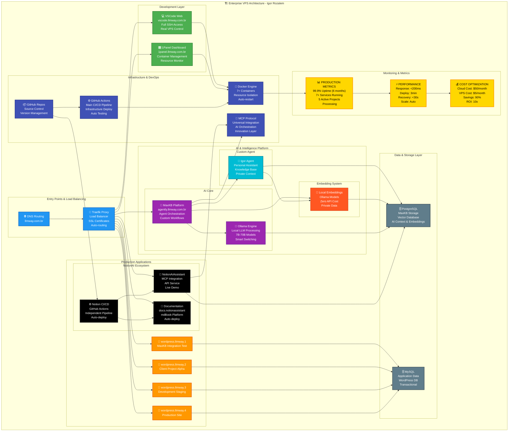

# 🏗️ Enterprise VPS Infrastructure Map

[](https://www.linkedin.com/in/igor-rozalem/)
[](https://github.com/igorhlr/vps-map)
[](https://github.com/igorhlr/vps-map)
[](https://github.com/igorhlr/vps-map)


<details>
<summary><b>📸 Click to view Full Screenshots</b></summary>

<div align="center">

### Infrastructure Overview


### Metrics Overview


### Models Overview


### Workflow Overview


### Online Vscode Overview



</div>

</details>


<details>
<summary><b>🗺️ Click to view Full Architecture Diagram</b></summary>



</details>


## 📊 Overview

Complete architecture diagram of my enterprise VPS infrastructure featuring **7+ production services**, **local AI embeddings**, and **90% cost reduction** compared to traditional cloud solutions.

---

---

## 🎯 Key Features

### 🧠 **Local AI Processing**
- **Zero API Costs**: All embeddings processed locally using Ollama
- **Private & Secure**: Data never leaves the server
- **Multiple Models**: Support for 7B to 70B parameter models
- **Smart Switching**: Automatic optimization between local and cloud

### 🤖 **Igor Agent - Custom Assistant**
- Personal Knowledge Base via local embeddings
- Context-aware with private data
- MaxKB Platform orchestration
- Zero external dependencies

### 🚀 **Technical Innovations**
- **MCP Protocol Integration**: Universal AI orchestration layer
- **Dual CI/CD Architecture**: Separate pipelines for infrastructure and NotionAssistant
- **Browser-Based IDE**: VSCode Web with full SSH access
- **Hybrid Processing**: Local LLMs for privacy, APIs for scale

### 📊 **Production Services**
- 4 WordPress sites with AI chatbots
- [NotionAiAssistant](https://github.com/igorhlr/NotionAiAssistant) with independent CI/CD
- Documentation platform with auto-deployment
- Development environments accessible via browser

---

---

## 🛠️ Technology Stack

<div align="left">

| Category | Technologies |
|----------|-------------|
| **Infrastructure** | Docker, Traefik, Ubuntu Server, Nginx |
| **AI Platform** | Ollama, MaxKB, Local Embeddings, MCP Protocol |
| **Databases** | MySQL, PostgreSQL with pgvector |
| **DevOps** | GitHub Actions (Dual Pipeline), 1Panel |
| **Development** | VSCode Web, Full SSH Access |

</div>

---

## 💡 Architecture Highlights

### **1. Entry Layer**
- Traefik proxy with SSL and load balancing
- Automatic routing for all services
- DNS management for subdomains

### **2. Development Layer**
- Browser-based VSCode with real VPS access
- 1Panel for container management
- Full SSH control (not containerized)

### **3. AI Layer**
- Local embeddings with zero API costs
- Igor Agent with private knowledge base
- MaxKB orchestration platform

### **4. Application Layer**
- Multiple WordPress sites
- NotionAiAssistant with MCP
- Auto-deployed documentation

### **5. Data Layer**
- MySQL for transactional data
- PostgreSQL with pgvector for embeddings
- Optimized for AI workloads

### **6. DevOps Layer**
- Main infrastructure pipeline
- Independent NotionAssistant pipeline
- Zero-downtime deployments

---

## 📈 Results & Impact

### **Cost Optimization**
```
Traditional Cloud: $50/month
This VPS Setup:    $5/month
Savings:           90% reduction
ROI:               10x
```

### **Performance**
```
Uptime:           99.9% (6 months)
Response Time:    <200ms average
Deploy Time:      3 minutes
Recovery Time:    <30 seconds
```

### **Scale**
```
Services:         7+ containers
Active Projects:  5
```

---

## 🔗 Live Projects Running

| Project | Description | Link |
|---------|-------------|------|
| **NotionAiAssistant** | MCP-powered Notion integration | [GitHub](https://github.com/igorhlr/NotionAiAssistant) |
| **Live Demo** | NotionAssistant in action | [Demo](https://notionassistant.llmway.com.br) |
| **Documentation** | Technical documentation | [Docs](https://docs.notionassistant.llmway.com.br) |
| **AI Platform** | MaxKB/Agently | [Platform](https://agently.llmway.com.br) |

---

## 🚀 Key Differentiators

✅ **Local embeddings with private knowledge base**  
✅ **Dual CI/CD for complex architectures**  
✅ **Browser IDE with real VPS access**  
✅ **Proven scalability with real metrics**  

---

## 📞 Get in Touch

Interested in learning more about:
- Building cost-effective AI infrastructure?
- Implementing local embeddings with zero API costs?
- Creating custom AI agents?
- Achieving 90% cost reduction while scaling?

### **Let's connect!**

[](https://www.linkedin.com/in/igor-rozalem/)
[](mailto:igorhlr2@icloud.com)

---

## 📄 License

This architecture diagram and documentation are shared for educational purposes. The actual infrastructure contains proprietary configurations.

---

<div align="center">
  
**Built with ❤️ by [Igor Rozalem](https://www.linkedin.com/in/igor-rozalem/)**

</div>